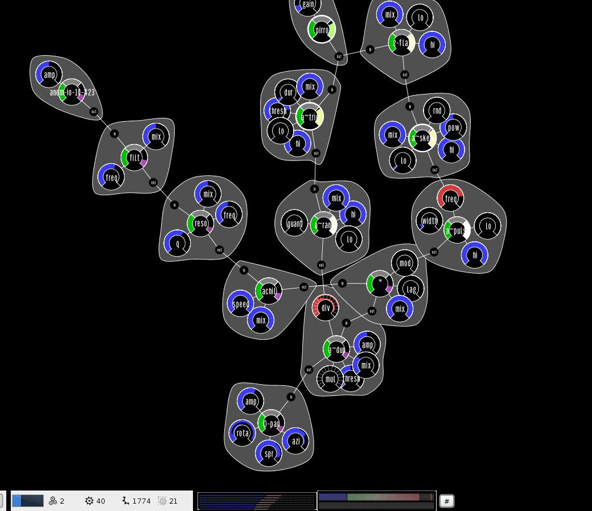

# Wolkenpumpe

## statement

Wolkenpumpe is a live improvisation interface based on ScalaCollider / SoundProcesses / Prefuse. It is (C)opyright 2008&ndash;2017 by Hanns Holger Rutz. All rights reserved. Wolkenpumpe is released under the [GNU General Public License](http://github.com/Sciss/Wolkenpumpe/blob/master/licenses/Wolkenpumpe-License.txt) and comes with absolutely no warranties. To contact the author, send an email to `contact at sciss.de`.

This is Wolkenpumpe 6th generation. Generation 5 was based on the old non-tracing Sound Processes version. Generation 4 was based on SuperCollider and SwingOSC, see [sourceforge.net/projects/tintantmare](http://sourceforge.net/projects/tintantmare/). Generation 3 was solely based on SuperCollider. Generation 1 or 2 was based on Max/MSP.

Note that you can use this interface through [Mellite](https://github.com/Sciss/Mellite/).

## building

Builds with sbt against Scala 2.12, 2.11.

## linking

    "de.sciss" %% "wolkenpumpe" % v

The current version `v` is `"2.21.2"`.

## contributing

Please see the file [CONTRIBUTING.md](CONTRIBUTING.md) for details.

## mouse control

- wheel zooms
- right-click auto zooms
- shift-press starts rubber-band selection
- double-click on panel brings up generator dialog
- double-click on edge brings up filter insertion dialog
- double-click on scan-out brings up filter append dialog
- double-click on node fixes/unfixes position
- alt-click on node deletes node
- shift-drag from scan-out brings up connector rubber-band
- shift-drag on parameter allows to find target value before releasing mouse. While you are dragging, you can press 0 to 9 to select a gliding time (0 = default = no gliding). Pressing a number twice adds randomisation to the gliding time. A rotary knob in the bottom right corner indicates the current gliding time. When gliding is used and the mouse is released, the parameter approaches the target value with a ramp of a duration given by the gliding time. Press <tt>Escape</tt> to abort a shift-drag.

## keyboard shortcuts

Global:

- <tt>1</tt> zoom 100%
- <tt>2</tt> zoom 200%
- <tt>O</tt> pan to next collector (O is for output)
- <tt>Control</tt>-<tt>Shift</tt>-<tt>F</tt> toggle full-screen
- <tt>Escape</tt> cancel on-screen dialogs
- <tt>Enter</tt> new-generator prompt. Start typing the name of generator, this also finds parts of hyphenated names.

Dialogs:

- <tt>Control</tt>-<tt>Enter</tt> commit

Scan-out:

- custom filter insertion short-cuts via object attribute with key `Nuages.attrShortcut` or `"nuages-shortcut"`
  and value being a string object such as `"X"` or `"shift P"`.
- <tt>Enter</tt> new-filter append prompt
- <tt>Shift</tt>-<tt>Enter</tt> new-collector append prompt. Start typing the name of the filter, this also finds parts of hyphenated names.

Edge:

- <tt>Enter</tt> new-filter insertion prompt

Parameter values:

- <tt>n</tt> minimum
- <tt>c</tt> center
- <tt>x</tt> maximum. If parameter is `amp` or `gain`: type twice fast (prevents erroneous activation)
- <tt>r</tt> random. If parameter is `amp` or `gain`: type twice fast (prevents erroneous activation)
- <tt>R</tt> multi-channel random. If you used more than one generator channel, this opens up the multiple channels of the parameter.  If parameter is `amp` or `gain`: type twice fast (prevents erroneous activation)
- <tt>[</tt> decrement
- <tt>]</tt> increment
- <tt>{</tt> decrement random inter-channel spread. If you used more than one generator channel, this opens up the multiple channels of the parameter.
- <tt>}</tt> increment random inter-channel spread
- <tt>Enter</tt> opens dialog to enter numeric parameter value

